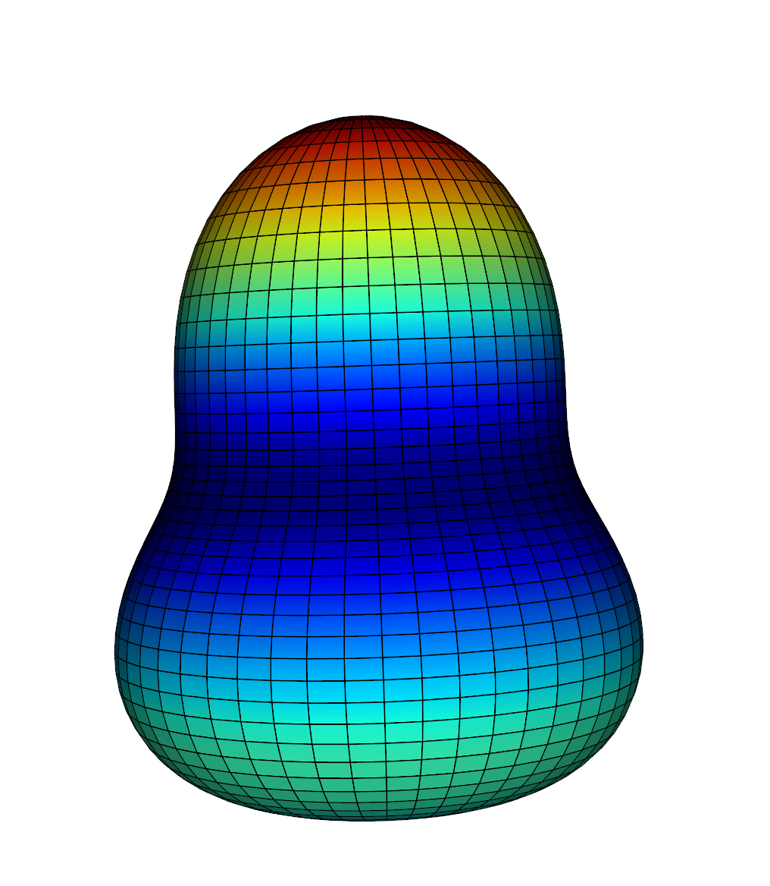

# Nuclear Fruitbowl
The Nuclear Fruitbowl is the moniker for the wide variety of different shapes of nucleii that exist in our universe, whilst beta paremeters give an idea of deformation to a trained physicist it can be hard to convey their meaning to the general public. If you've ever wondered what a 'Pear Shaped' nucleus really means then this program may be useful to you. This program has been developed to allow physicists to generate a variety of nuclear shapes for raster visualisation in Blender and producing models for 3D printing to help communicate nuclear structure to a wider audience.

# Citing this program:
If using this program in academic publications please consider citing us so that others can learn of our research. 
```
@misc{NuclearFruitbowl,
  author = {Holloway, F and Cubiss, J},
  title = {Nuclear Fruitbowl: A Nuclear Shape Generator},
  year = {2023},
  publisher = {GitHub},
  journal = {GitHub repository},
  howpublished = {\url{https://github.com/fraseyboo/nuclear_generator/tree/master}}
}
```
# Future Work:

We would like to add support for the following in the near future:
* Potential energy surface maps in ($\beta$, $\gamma$).
* Animation support using the gltf framework for PowerPoint Presentations

# Example Plots:

Some of the possible plots you can make with this program and a little creativity:


The shapes generated from this program couple well with the 3D nuclide chart from https://people.physics.anu.edu.au/~ecs103/chart/


Gridlines can be enabled to produce high-resolution raster images



Normals are generated allowing for physically-based rendering, cubemaps are supported to do complex reflections


Direct exporting to Blender allows for more advanced rendering:


